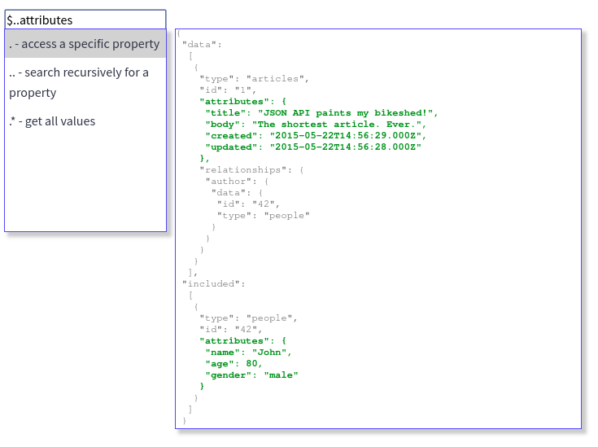

# react-jsonpath-editor

[![Travis][build-badge]][build]
[![npm package][npm-badge]][npm]
[![Coveralls][coveralls-badge]][coveralls]



## Usage

install the dependency using `npm` or `yarn`

```
npm i --save react-jsonpath-editor
```


```
yarn add react-jsonpath-editor
```

```javascript
import React, {Component} from 'react'
import JsonPathEditor from 'react-jsonpath-editor';

class App extends Component {
    render() {
        return <div>
            <JsonPathEditor />
        </div>;
    }
}
```

## Properties

| Props         | Type          | Required  | Description                                           |
|:-------------:|:-------------:|:---------:|-------------------------------------------------------|
|   inputProps  |    object     |   false   | Properties passed down to the input                   |
|     value     |    string     |   false   | input default value                                   |
|     json      |    object     |   false   | json to test the json path and provide autocompletion |
|    onChange   |   function    |   false   | callback called when jsonPath changed                 |

[build-badge]: https://img.shields.io/travis/JeanBaptisteWATENBERG/react-jsonpath-editor/master.png?style=flat-square
[build]: https://travis-ci.org/JeanBaptisteWATENBERG/react-jsonpath-editor

[npm-badge]: https://img.shields.io/npm/v/npm-package.png?style=flat-square
[npm]: https://www.npmjs.com/package/react-jsonpath-editor

[coveralls-badge]: https://img.shields.io/coveralls/JeanBaptisteWATENBERG/react-jsonpath-editor/master.png?style=flat-square
[coveralls]: https://coveralls.io/github/JeanBaptisteWATENBERG/react-jsonpath-editor
